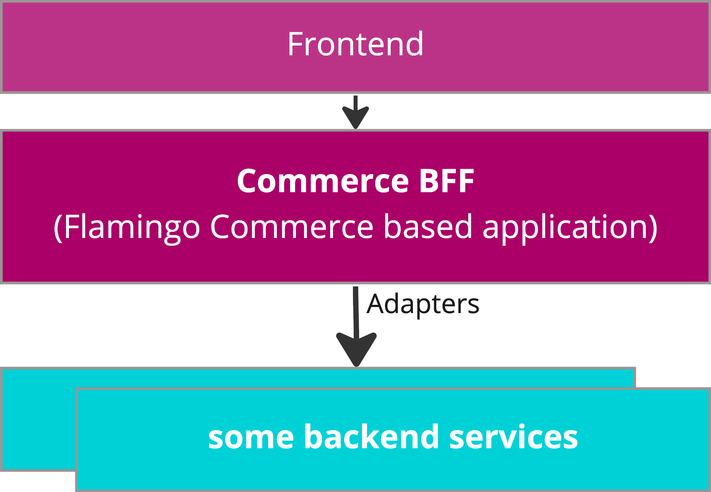
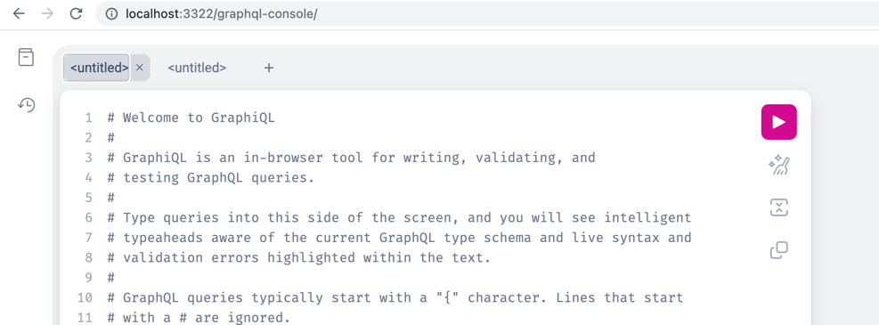

# Start

# About Flamingo Commerce
Flamingo Commerce is an e-commerce framework written in go.
It includes a set of modules that allows you to build flexible e-commerce solutions.
Flamingo Commerce is build on top of Flamingo (a web framework based on Go).

The high level architecture of an e-commerce application build with Flamingo-Commerce typically looks like this:


* Frontend: Typically a shopping frontend with product view, cart, checkout, payment etc. The frontend can be build using serverside template engine or it can be decoupled and access all logic via graphQL (which is recommended).
* Commerce BFF: The main e-commerce application can be considered as a "backend for frontend". It offers access to all the required e-commerce and shopping logic.
* Adapters: Part of the BFF applications are adapters to individual other services.

So Flamingo Commerce offers a "headless" ecommerce APIs and can be used in microservice oriented architectures for customer facing e-commerce and shopping use cases.

# About this article
In this post you will learn how you can use Flamingo Commerce to build an e-commerce Webshop.

We will start step by step with an empty project - and we will end up with a complete workable shop - including a HTML view and a full featured graphQL API and Rest API.

You will also learn on an example how individual adapters can be used to connect the webshop to any data sources: In this case we will load products from a CSV file

# 1. Start a "myshop" project with products

Lets start with creating an empty go project:

```shell
mkdir example-commerce
cd example-commerce
go mod init example-commerce
go get -v flamingo.me/flamingo-commerce/v3
```
This created a new go module "example-commerce" and added "flamingo-commerce" as an dependency.
You can check this by opening the `go.mod` file inside your project.

We will then kickstart the application and we will start by using the product module.
Therefore create a file `main.go` inside your project with the following content:

```go
package main

import (
	"flamingo.me/dingo"
	"flamingo.me/flamingo-commerce/v3/product"
	"flamingo.me/flamingo/v3"
)

func main() {
	flamingo.App([]dingo.Module{
		new(product.Module),
	})
}
```
This 3 lines inside the main func will initialize a Flamingo application with the product module.
When starting your project the Flamingo default bootstrap will start.

Lets try this and run the application:

`go run main.go`

You will see the list of available commands. You can run

`go run main.go config`  to see the active default configuration of your project.

We will learn more about the configuration later.
But for now lets try to run the application by:
`go run main.go serve`

You will see the following error `can not instantiate interface flamingo.me/flamingo-commerce/v3/product/domain.ProductService` together with a stack trace.

That means that there is no ProductService registered yet. The ProductService is a so called Adapter that the product module needs in order to get products.
For now we will enable the provided "FakeProductService" that just provides some dummy products.

We will do this with setting the feature flag via configuration.
Please create a config file in the path "config/config.yml":

```shell script
mkdir config
cat config/config.yml
```

With the following content:
```yaml
flamingo.session.cookie.secure: false

commerce:
  product:
    fakeservice:
      enabled: true
```
The first line disables the session cookie secure mode - this is required for local testing.
The rest configures the Flamingo Commerce product module and enables a dummy adapter that provides two fake products for testing purposes.

You can now successfully start the application and try that out:

```shell script
go run main.go serve
```

and open the url for a product single view:

* http://localhost:3322/product/fake_simple/typesimple-product.html
* http://localhost:3322/product/fake_configurable/typeconfigurable-product.html


What you see is the plain data for a product single page.
Because we have no template engine configured, Flamingo will just output the data as JSON. (We will configure templates in step 3 of this tutorial)

By the way the products module also offers a Rest API to access product data:

* http://localhost:3322/api/v1/products/fake_configurable

## 2. Add more commerce functionality
Now we want to add more Flamingo Commerce features. So we are going to include the following modules:

* cart: Provides features to deal with a cart (supporting multiple deliveries)
* category: Provides features to browse in a category tree
* checkout: Provides a basic checkout controller with a typical flow

Therefore edit again your project `main.go` file and add the missing modules to the Bootstrap like this:

```go
package main

import (
	"flamingo.me/dingo"
	"flamingo.me/flamingo-commerce/v3/cart"
	"flamingo.me/flamingo-commerce/v3/category"
	"flamingo.me/flamingo-commerce/v3/checkout"
	"flamingo.me/flamingo/v3"
	"flamingo.me/flamingo-commerce/v3/product"
)

func main() {
	flamingo.App([]dingo.Module{
		new(product.Module),
		new(cart.Module),
		new(category.Module),
		new(checkout.Module),
	})
}

```

Like the product module also the other module provides several "ports" where adapters can be registered.
The registered adapters are responsible for implementing the detail functionality of the modules:
For example there can be adapters for the cart module, that work with the Magento Cart API or the shopify API.

For testing purposes we are also using the simple adapters that are included in the Flamingo Commerce packages (they are activated by configuration).
So before we can use the newly added commerce modules, we need to configure the required adapters.
Therefore add the following configuration to your `config/config.yml`

```yaml
flamingo.session.cookie.secure: false

commerce:
  product:
    fakeservice:
      enabled: true
  cart:
    emailAdapter:
      # The email where place order infos are send to:
      emailAddress: lkklj@lkjkj.de
  customer:
    # Activate the nil customer adapter (that returns no infos about a logged in user :-))
    useNilCustomerAdapter: true
  category:
    # Activate a simple category adapter that just returns the configured tree
    useCategoryFixedAdapter: true
    categoryServiceFixed:
      tree:
        category1:
          code: category1
          name: Category 1
        category2:
          code: category2
          name: Category 2
  payment:
    # Include the basic payment gateway adapter that provides "offline" payment methods
    enableOfflinePaymentGateway: true
```

The cart module also uses the Flamingo oauth module - because it supports stored customer carts and placing orders for authenticated customers.
If you like you can already add the configuration for an openid (oauth2) provider like this (but it is not required):
```yaml
core:
  oauth:
    server: "https://accounts.google.com"
    clientid: "xxxxxxxxxx.apps.googleusercontent.com"
    secret: "xxxxxx"
```
You can find more infos on [how to use google as openid-connect provider here.](https://developers.google.com/identity/protocols/oauth2/openid-connect)

You can check all the registered routes on the command line by calling `go run main.go routes`.

At this stage you could already use the Ajax Rest APIs and for example work with the cart from a browser application.


## 3. Work with the APIs

Flamingo Commerce comes with restful APIs and a full featured graphQL API that can be used from frontends (for example build as single page applications).
We recommend to use the graphQL API because it covers more features - including checkout state handling and payment processing.

## 3.1. GraphQL API
Add the Flamingo graphql module to your project:

`go get flamingo.me/graphql`

And then add it to your `main.go`

```go
package main

import (
	"flamingo.me/dingo"
	"flamingo.me/flamingo-commerce/v3/cart"
	"flamingo.me/flamingo-commerce/v3/category"
	"flamingo.me/flamingo-commerce/v3/checkout"
	"flamingo.me/flamingo-commerce/v3/product"
	"flamingo.me/flamingo/v3"
	"flamingo.me/graphql"
)


func main() {
	flamingo.App([]dingo.Module{
		new(product.Module),
		new(cart.Module),
		new(category.Module),
		new(checkout.Module),
		new(graphql.Module),
	})
}
```

You might need to tidy up the dependencies by running: `go mod tidy` after this.

The graphql module provides a new flamingo command that generates the projects graphql resolver.
This is necessary because the overall graphql schema depends on all the modules that are loaded in your project.

Run this command:

```
go run -tags graphql main.go graphql
```
After the command is ready you have your projects root graphql resolver and schema generated in the folder "graphql"

Please have a look into the generated files:

```shell
ls -al graphql
```

As you see the *graphql* command generated the overall graphQL schema (schema folder), the corresponding interfaces (generated.go) and even the graphQL resolver (resolver.go).
It also generated a Flamingo module (module.go) - which we just need to include in our projects bootstrap.

To include the generated module, we again edit your `main.go` file:

```go
package main

import (
	"flamingo.me/dingo"
	"flamingo.me/flamingo-commerce/v3/cart"
	"flamingo.me/flamingo-commerce/v3/category"
	"flamingo.me/flamingo-commerce/v3/checkout"
	"flamingo.me/flamingo-commerce/v3/product"
	"flamingo.me/flamingo/v3"
	"flamingo.me/graphql"
	projectGraphql "example-commerce/graphql"
)

//go:generate rm -f graphql/generated.go
//go:generate go run -tags graphql main.go graphql

func main() {
	flamingo.App([]dingo.Module{
		new(product.Module),
		new(cart.Module),
		new(category.Module),
		new(checkout.Module),
		new(graphql.Module),
		new(projectGraphql.Module),
	})
}
```

In order to activate the graphql console with schema browsing we need to activate it in the configuration.
Edit your `config.config.yml` and add the following line:

```yaml
graphql:
  introspectionEnabled: true
```

Now run your application again with `go run main.go serve` and if you now open http://localhost:3322/graphql-console/ you should see the graphql console:



There are many query and mutations to discover. 
Lets play with it a bit:

Get products:
```graphql
query productssimple {
  Commerce_Product(marketPlaceCode: "fake_simple") {
    title
    marketPlaceCode
    price {
      default {
        amount
        currency
      }
    }
    attributes {
      attributes {
        code
        codeLabel
        label
      }
    }
  }
}
```


And to add this procust to the cart:
```graphql
mutation addToCart {
  Commerce_Cart_AddToCart(addToCartInput: {marketplaceCode: "fake_simple", qty: 1, deliveryCode: "delivery"}) {
    cart {
      id
      deliveries {
        cartitems {
          id
          productName
        }
      }
    }
  }
}
```

To view the cart:
```graphql

query viewCart {
  Commerce_Cart_DecoratedCart {
    cart {
      deliveries {
        deliveryInfo {
          method
        }
        cartitems {
          id
          productName
          qty
          rowPriceNet {
            amount
            currency
          }
        }
      }
      grandTotal {
        amount
        currency
      }
    }
  }
}
```

Then we at least need to set the desired payment method:
```graphql
mutation addpayment {
  Commerce_Cart_UpdateSelectedPayment(gateway: "offline", method:"offlinepayment_cashondelivery") {
    processed
  }
} 
```
And start the place order process:
```graphql
mutation placeorder {
  Commerce_Checkout_StartPlaceOrder(returnUrl:"") {uuid}
}
```
The place order process is designed as a background process and Flamingo Commmerce ensures that there is only one active place order process.
Since a payment method might require external redirects you can always check for the current status of the active place order process:

```graphql

query placeordercontext { 
  Commerce_Checkout_CurrentContext{
    state {
      name
      __typename
      ... on Commerce_Checkout_PlaceOrderState_State_Failed {name reason {reason}}      
    }
    orderInfos {
      paymentInfos {amount{amount currency}}
      email
      placedOrderInfos {orderNumber}
    }
    uuid
    
  }
}
```

Since in our case no payment redirect is required, you will see the place order process in the state "Commerce_Checkout_PlaceOrderState_State_Success" and you will see the order number.

If that worked for you until here: Congratulations - we sucessfully placed an order through the graphQL API of Flamingo Commerce.
You can use the very same APIs from a single page application or any other client.


## 5. Implement you own adapters


